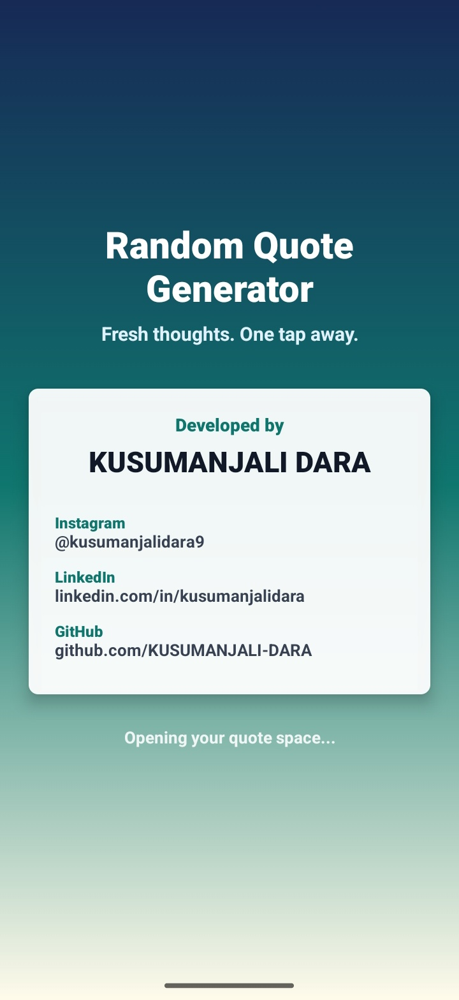
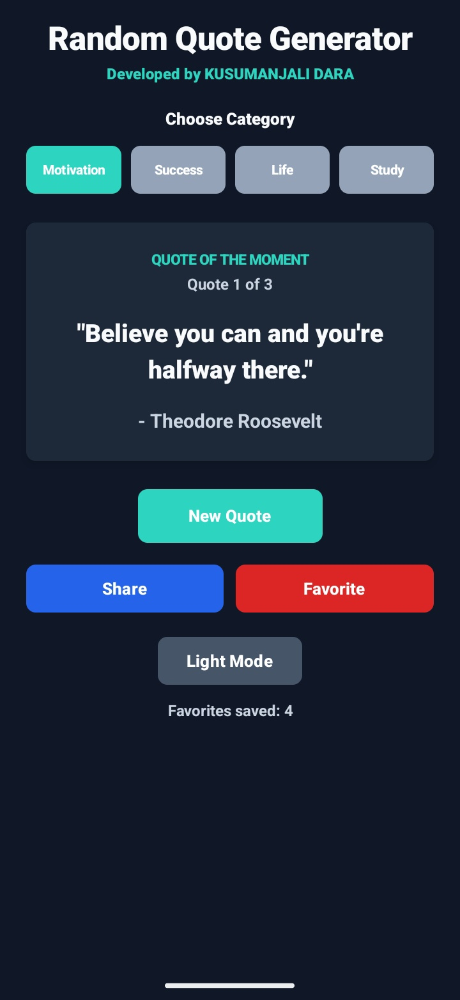
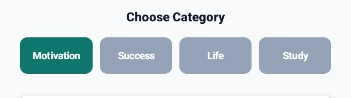
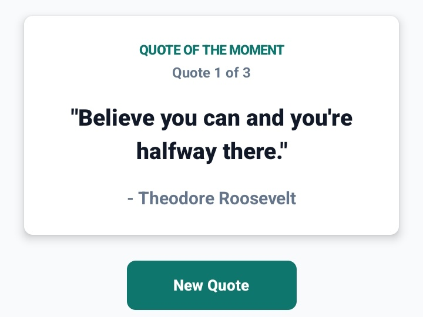
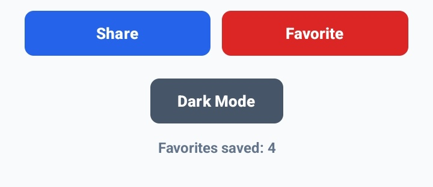
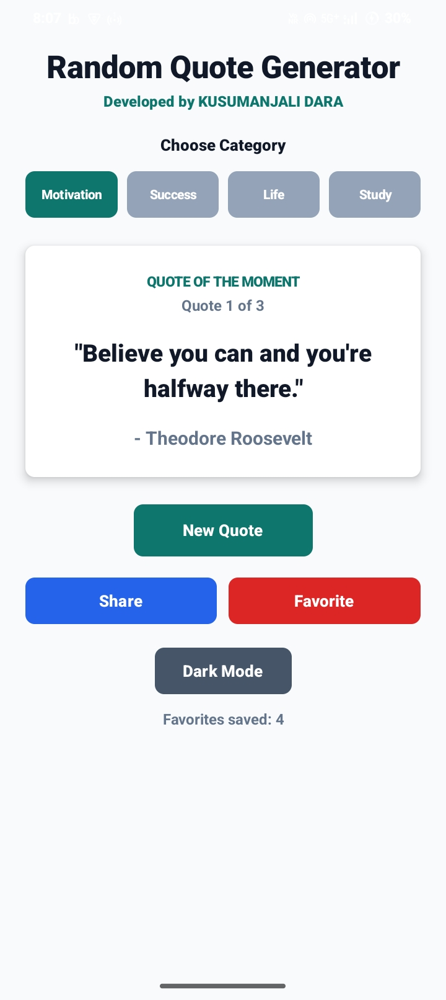

# Random Quote Generator App

An Android application built using Kotlin and Jetpack Compose that displays random quotes with author names. The app includes category-based quotes, sharing, favorites, a quote counter, and light/dark mode support.

## Developed By

**KUSUMANJALI DARA**

- Instagram: @kusumanjalidara9
- LinkedIn: linkedin.com/in/kusumanjalidara
- GitHub: github.com/KUSUMANJALI-DARA

## Features

- Displays a random quote with author name
- New Quote button to generate another quote
- Quote categories: Motivation, Success, Life, and Study
- Share Quote feature using Android share intent
- Favorite Quote feature using local storage
- Quote counter such as Quote 1 of 3
- Light and dark mode toggle
- Developer intro screen with social links
- Clean and minimal Jetpack Compose UI

## Tech Stack

- Kotlin
- Jetpack Compose
- Android Studio
- SharedPreferences

## Screenshots

### Intro Screen

### Home Screen - Dark Mode

### Category Filter

### Quote Card

### Actions And Favorites

### Home Screen - Light Mode

## How To Run

1. Clone this repository.
2. Open the project in Android Studio.
3. Wait for Gradle sync to complete.
4. Connect an Android device or start an emulator.
5. Click Run.

## Learning Outcome

This project helped me learn Android app development using Kotlin and Jetpack Compose, including UI design, state management, category filtering, Android intents, local storage, and theme switching.
